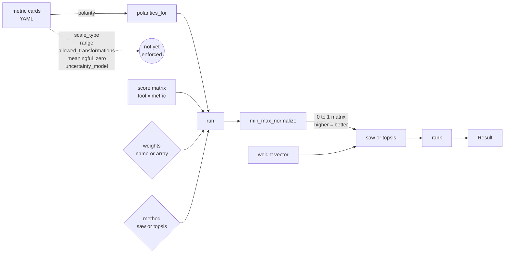

# What the MCDA pipeline consumes from the metric cards

A metric card declares fields covering identity, kind, inputs, output, semantics, comparability, implementations, examples, and provenance. The current MCDA pipeline consumes one of these fields: per-metric `polarity`. The remaining fields are recorded as metadata and are not read by `beam.mcda.run`. This document enumerates the consumed and unconsumed fields and lists the planned extensions.

## Data flow

Solid edges denote fields read by the current pipeline. Dashed edges mark fields declared in the metric cards but not consumed by `beam.mcda.run`.

## Fields consumed

- `polarity`: passed to `min_max_normalize`, which inverts columns marked `lower_is_better` and rescales each column to [0, 1]. The resulting matrix is oriented so that higher values denote better performance for every column. The aggregator (SAW or TOPSIS) operates on this orientation and does not access `polarity` directly.

## Fields declared but not enforced

- `scale_type`: the schema admits the values `nominal`, `ordinal`, `interval`, and `ratio`. The pipeline does not validate whether the requested aggregation is admissible for the declared scale. No error is raised when an ordinal column is passed through `min_max_normalize` and aggregated with SAW.
- `range`: declared lower and upper bounds per metric. `min_max_normalize` rescales each column using the empirical minimum and maximum of the score matrix; the declared bounds are not consulted. A column whose observed maximum lies below its declared upper bound is mapped to 1 at the observed maximum.
- `allowed_transformations`: the schema lists permitted transformations per metric. The pipeline does not consult this field.
- `meaningful_zero`: declared on every card. Neither SAW nor TOPSIS reads this field.
- `uncertainty_model`: declared on derived metrics. The pipeline does not propagate uncertainty; the field is unread.

## Planned enforcement

1. Compatibility check between `scale_type` and the requested aggregation at the entry to `run`, rejecting combinations such as a geometric mean on an interval-scale metric or an arithmetic mean across ordinal columns.
2. Use of the declared `range` bounds in `min_max_normalize` when present, in place of the empirical extrema.
3. Validation of every applied transformation against `allowed_transformations`, covering `min_max_normalize` and future log, arcsin, or rank transforms.
4. Propagation of per-score uncertainty through the aggregation step, conditional on extending the aggregation methods to accept standard errors.

As each item lands, the corresponding edge in the diagram is reclassified from dashed to solid.
