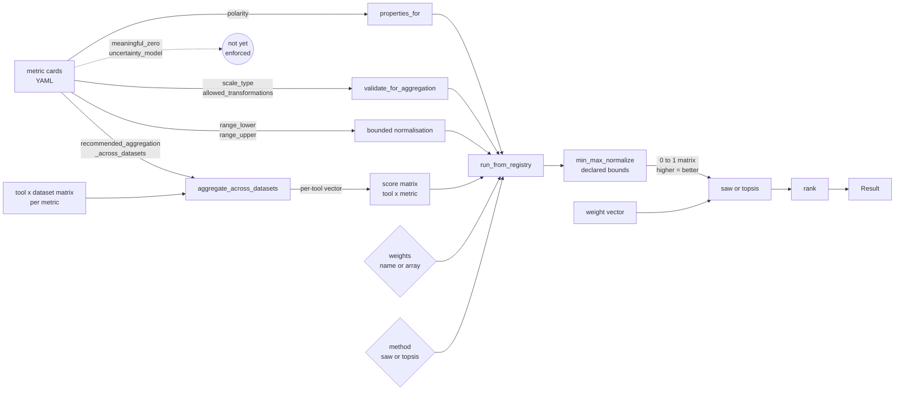

# What the MCDA pipeline consumes from the metric cards

A metric card declares fields covering identity, kind, inputs, output, semantics, comparability, implementations, examples, and provenance. The pipeline binds to a growing subset of these. As of the current release the ontology-aware entry `run_from_registry` consumes per-metric `polarity`, declared `range` bounds, declared `scale_type`, and the set of `allowed_transformations`. The cross-dataset aggregation primitive consumes `comparability.recommended_aggregation_across_datasets`. The remaining fields are recorded as metadata and are not enforced.

## Data flow

Solid edges denote fields read by the current pipeline. Dashed edges mark fields declared in the metric cards but not yet consumed.

## Fields consumed

- `polarity`: passed to `min_max_normalize`, which inverts columns marked `lower_is_better` and rescales each column to [0, 1]. The resulting matrix is oriented so that higher values denote better performance for every column.
- `range_lower`, `range_upper`: when both bounds are declared on a card, `run_from_registry` forwards them to `min_max_normalize`. The normalisation uses the theoretical range rather than the empirical extrema, so two benchmarks using the same metric on different score subsets produce comparable rescaled values. Observations outside the declared range raise.
- `scale_type`: `validate_for_aggregation` refuses SAW or TOPSIS on columns whose declared scale type is `nominal` or `ordinal`. Only `interval` and `ratio` columns pass.
- `allowed_transformations`: `validate_for_aggregation` requires the set to include `affine` or `min_max`, because `min_max_normalize` applies a min-max (affine) transformation before any aggregation.
- `comparability.recommended_aggregation_across_datasets`: `aggregate_across_datasets` consumes this when reducing a tool by dataset matrix to a tool vector for one metric. Ratio metrics whose values span orders of magnitude (runtime, peak memory) declare `geometric_mean` per Smith 1988; bounded interval and ratio metrics declare `arithmetic_mean`.

## Fields declared but not enforced

- `meaningful_zero`: declared on every card; no current consumer.
- `uncertainty_model`: declared on derived metrics; the pipeline does not propagate uncertainty through aggregation.
- `monotonic`: declared on every card; no current consumer.
- `comparability.comparable_within` and free-form `aggregation_rules` notes: declared on every card; used only by humans reading the cards.

## Planned enforcement

1. Use the declared `uncertainty_model` to propagate standard errors through normalisation and aggregation, so the composite carries a usable error bar.
2. Enforce `comparability.comparable_within` to refuse cross-task aggregation when no card permits it.
3. Translate free-form `aggregation_rules` notes into machine-readable constraints over time; the `recommended_aggregation_across_datasets` enum is the first such migration.

As each item lands, the corresponding edge in the diagram is reclassified from dashed to solid.
